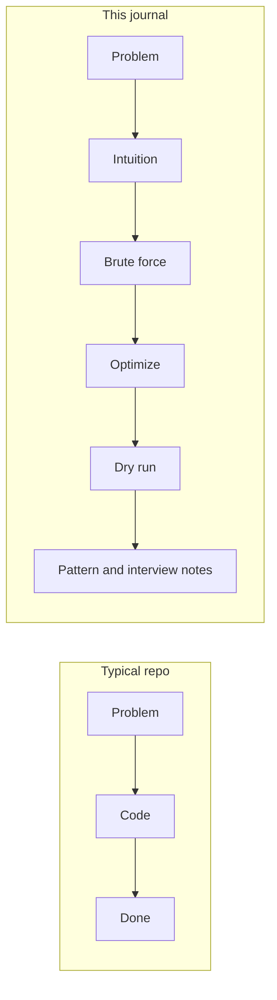
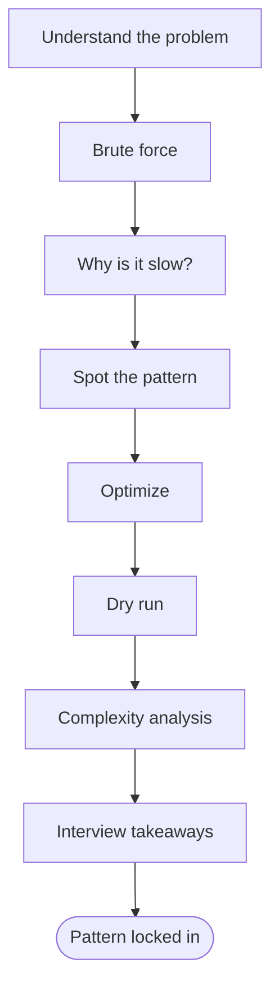
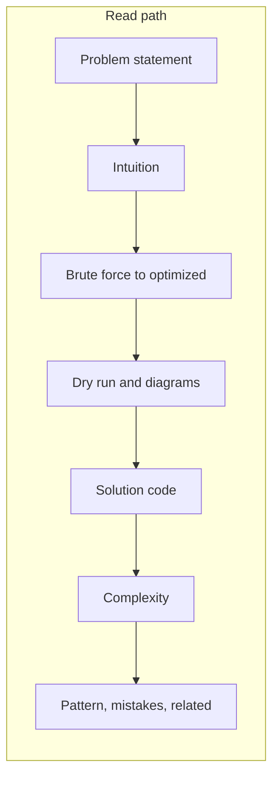
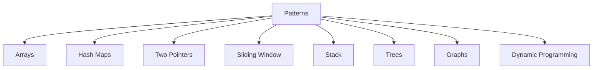
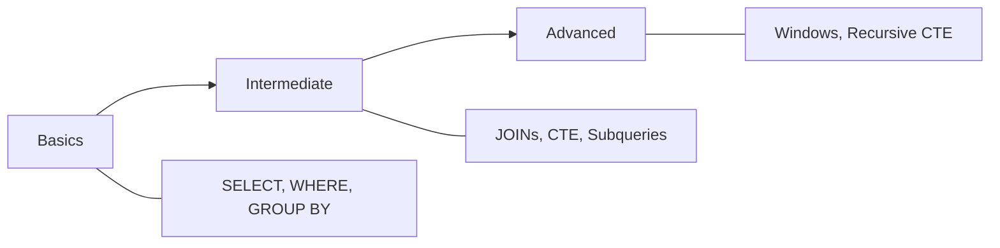

# DSA Journal

> A structured journey through Data Structures, Algorithms, and SQL interview problems — focused on **intuition**, **pattern recognition**, and real understanding rather than memorization.


|              |                                                                   |
| ------------ | ----------------------------------------------------------------- |
| **Language** | Python · SQL                                                      |
| **Format**   | Markdown + Mermaid diagrams                                       |
| **Goal**     | Understand *why* a solution works and *when* to reuse the pattern |


---

## Why this repo?

Most LeetCode repos stop at problem → code → done. This one treats each problem as a mini-lesson.




| Typical repo         | This journal                         |
| -------------------- | ------------------------------------ |
| Final answer only    | Full reasoning chain                 |
| Copy-paste solutions | Step-by-step dry runs                |
| One-off tricks       | Reusable patterns                    |
| No context           | Interview insights & common mistakes |


---

## Learning loop

Every problem follows the same process — build the habit once, apply it everywhere.




The point isn't to memorize 200 solutions. It's to recognize *"I've seen this shape before"* and reach for the right tool.

---

## Repository layout

```
dsa-journal/
│
├── python/
│   ├── arrays/              ← Two Sum, 3Sum, …
│   ├── strings/
│   ├── linked-list/
│   ├── stack/
│   ├── queue/
│   ├── binary-search/
│   ├── trees/
│   ├── graphs/
│   ├── heap/
│   ├── dynamic-programming/
│   └── backtracking/
│
├── sql/
│   ├── basics/
│   ├── joins/
│   ├── aggregation/
│   ├── subqueries/
│   ├── cte/
│   └── window-functions/
│
├── notes/                   ← cross-cutting concepts
└── assets/                  ← diagrams & images
```

Each problem lives in its own folder:

```
python/arrays/two_sum/
├── README.md      ← full write-up (intuition, dry run, diagrams)
└── solution.py    ← clean implementation
```

---

## Problem template

Every write-up includes the same sections so you always know where to look.




| Section             | What you get                       |
| ------------------- | ---------------------------------- |
| Problem statement   | Constraints, examples, edge cases  |
| Intuition           | The "aha" moment in plain language |
| Brute force         | Baseline approach + why it's slow  |
| Optimized approach  | The pattern-driven solution        |
| Dry run             | Trace through a concrete example   |
| Visual diagrams     | Flows, tables, ASCII snapshots     |
| Solution            | Minimal, readable Python           |
| Complexity          | Time & space with reasoning        |
| Pattern recognition | When to reuse this technique       |
| Common mistakes     | What interviewers watch for        |
| Related problems    | Where to practice the same pattern |


**Example:** [Two Sum](python/arrays/two_sum/README.md) — hash map, one-pass lookup.

---

## Python roadmap

Track progress as problems are added. `[x]` = documented with full write-up.

### Arrays

- [Two Sum](python/arrays/two_sum/README.md)
- Best Time to Buy and Sell Stock
- Product of Array Except Self
- Container With Most Water
- 3Sum

### Hash maps / hash sets

- Contains Duplicate
- Valid Anagram
- Group Anagrams
- Top K Frequent Elements
- Longest Consecutive Sequence

### Two pointers

- Valid Palindrome
- Two Sum II
- Move Zeroes
- Merge Sorted Array

### Sliding window

- Longest Substring Without Repeating Characters
- Minimum Window Substring
- Permutation in String

### Stack

- Valid Parentheses
- Min Stack
- Daily Temperatures
- Evaluate Reverse Polish Notation

### Trees

- Maximum Depth of Binary Tree
- Same Tree
- Invert Binary Tree
- Binary Tree Level Order Traversal

### Graphs

- Number of Islands
- Clone Graph
- Course Schedule

### Dynamic programming

- Climbing Stairs
- House Robber
- Coin Change
- Longest Increasing Subsequence




---

## SQL roadmap

### Basics

- SELECT
- WHERE
- ORDER BY
- GROUP BY
- HAVING

### Intermediate

- JOINs
- Subqueries
- CASE
- UNION
- CTE

### Advanced

- Window functions
- Recursive CTE
- Ranking functions
- Query optimization




---

## Progress


| Category            | Done | Planned |
| ------------------- | ---- | ------- |
| Python problems     | 1    | 40+     |
| SQL exercises       | 0    | 20+     |
| Patterns documented | 1    | 15+     |


```
Python  ▓░░░░░░░░░░░░░░░░░░░   1 / 40+
SQL     ░░░░░░░░░░░░░░░░░░░░   0 / 20+
```


| Pattern             | Status | Example                                    |
| ------------------- | ------ | ------------------------------------------ |
| Hash map            | ✅      | [Two Sum](python/arrays/two_sum/README.md) |
| Two pointers        | —      | —                                          |
| Sliding window      | —      | —                                          |
| Stack               | —      | —                                          |
| BFS / DFS           | —      | —                                          |
| Dynamic programming | —      | —                                          |


---

## Tech stack


| Tool     | Role                            |
| -------- | ------------------------------- |
| Python 3 | Algorithm implementations       |
| SQL      | Query practice & patterns       |
| Markdown | Problem write-ups               |
| Mermaid  | Flowcharts, mind maps, dry runs |


---

## Contributing

This is primarily a personal learning journal. If you spot a mistake, a clearer explanation, or a better approach — open an Issue or Pull Request.

---

## Star

If this repo helps you understand algorithms — not just solve them — consider giving it a ⭐.