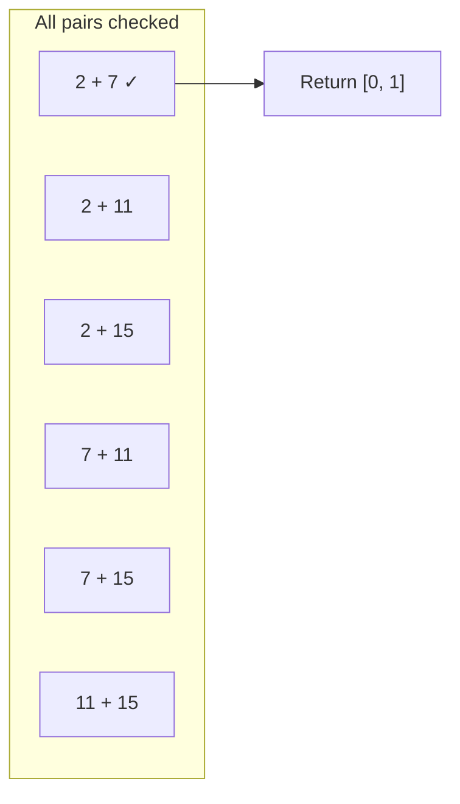
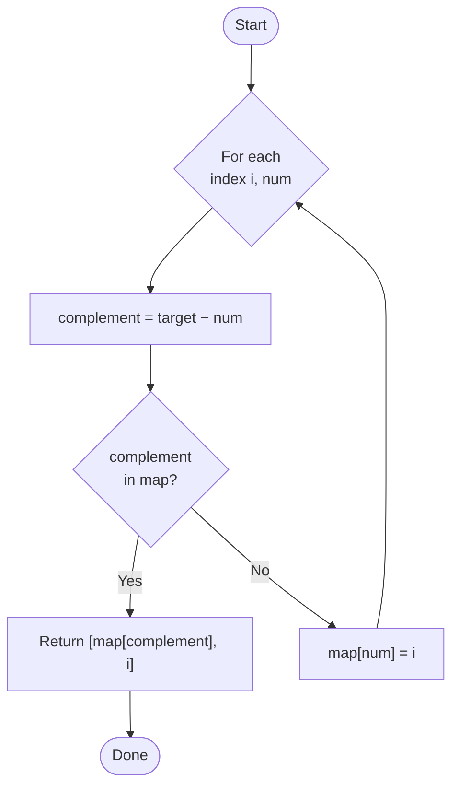
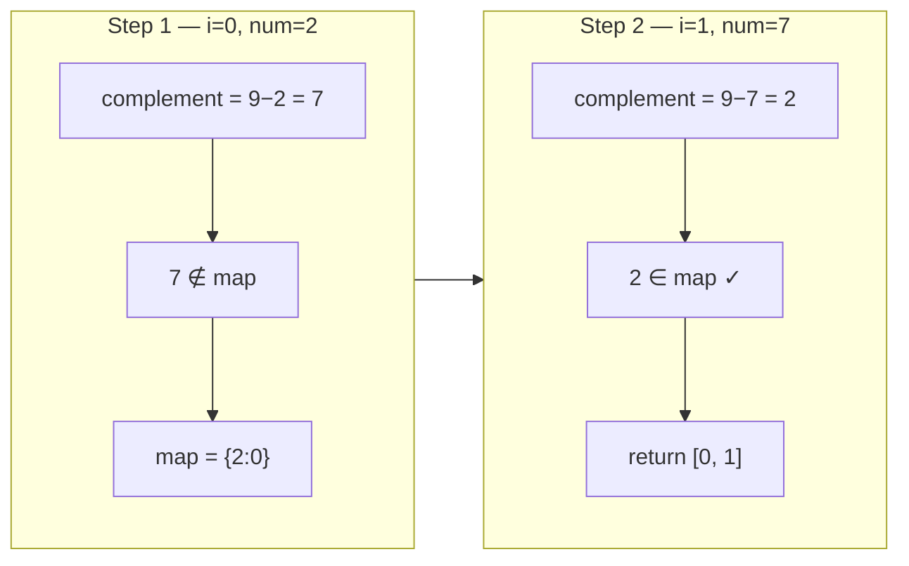
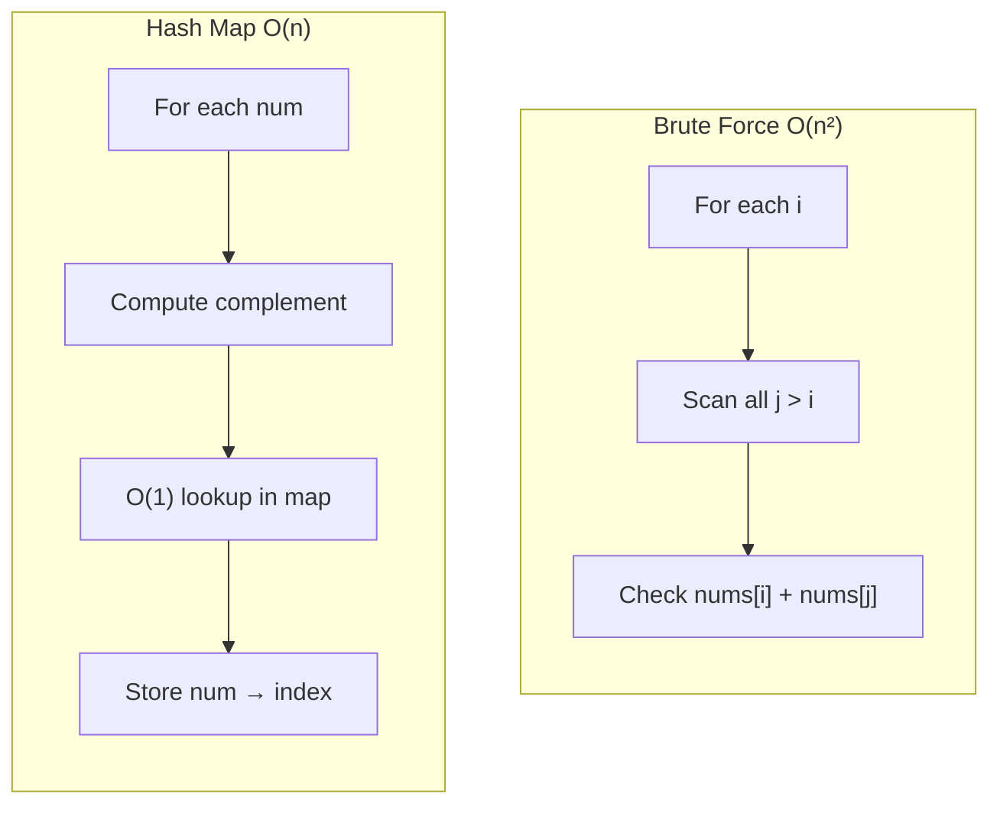

# Two Sum

| | |
|---|---|
| **Difficulty** | Easy |
| **LeetCode** | [#1](https://leetcode.com/problems/two-sum/) |
| **Pattern** | Hash Map |
| **Topics** | Array · Hash Table |

---

## Problem

Given an array of integers `nums` and an integer `target`, return the **indices** of the two numbers that add up to `target`.

**Constraints**

- Exactly one solution exists
- You may not use the same element twice
- Return indices, not values

**Example**

```
nums   = [2, 7, 11, 15]
target = 9

answer = [0, 1]    →  nums[0] + nums[1] = 2 + 7 = 9
```

```
Index:  0   1   2    3
        ┌───┬───┬────┬────┐
nums:   │ 2 │ 7 │ 11 │ 15 │
        └───┴───┴────┴────┘
         ╲   ╱
          ╲ ╱
           9  ← target
```

---

## Approach 1 — Brute Force

Pick each number, pair it with every number after it, and check the sum.



```
nums = [2, 7, 11, 15]

  i=0  →  compare with j=1,2,3
  i=1  →  compare with j=2,3
  i=2  →  compare with j=3
```

| | Time | Space |
|---|:---:|:---:|
| Brute force | O(n²) | O(1) |

Works, but repeats work — every lookup scans the array again.

---

## The Insight

At index `0`, the current number is `2`. You don't need to scan the rest of the array.

Ask one question instead:

> **What number do I still need to hit the target?**

```
target          =  9
current (nums[0]) =  2
─────────────────────
complement      =  9 − 2 = 7
```

Then ask:

> **Have I already seen `7`?**

That reframes the problem from *"who can I pair with?"* to *"is my complement already in memory?"*

---

## Approach 2 — Hash Map (One Pass)

Store `{ value → index }` as you walk the array. For each number, compute its complement and look it up in O(1).



**Why a hash map?**

| Operation | Brute force | Hash map |
|---|:---:|:---:|
| "Have I seen this?" | O(n) scan | O(1) lookup |
| Per element | O(n) | O(1) |

---

## Dry Run

```
nums   = [2, 7, 11, 15]
target = 9
```



### Step-by-step table

| Step | `i` | `num` | `complement` | `complement in map?` | Action | Map after |
|:---:|:---:|:---:|:---:|:---:|---|---|
| 1 | 0 | 2 | 7 | No | Store `2 → 0` | `{2: 0}` |
| 2 | 1 | 7 | 2 | **Yes** | Return `[0, 1]` | — |

```
Step 1                          Step 2
────────                        ────────
i=0  num=2                      i=1  num=7
     need 7                           need 2
     map: {}                           map: {2:0}
          ↓ store                           ↓ found!
     map: {2:0}                      return [0, 1] ✓
```

---

## Brute Force vs Hash Map



| | Brute force | Hash map |
|---|:---:|:---:|
| **Time** | O(n²) | **O(n)** |
| **Space** | O(1) | O(n) |
| **Idea** | Try every pair | Remember what you've seen |

---

## Solution

```python
class Solution:
    def twoSum(self, nums, target):
        lookup = {}

        for i, num in enumerate(nums):
            complement = target - num

            if complement in lookup:
                return [lookup[complement], i]

            lookup[num] = i
```

| Step | What happens |
|---|---|
| `complement = target - num` | Compute the value we still need |
| `if complement in lookup` | O(1) check — have we seen it? |
| `lookup[num] = i` | Record current value for future lookups |

---

## Complexity

| Operation | Complexity |
|---|:---:|
| Traverse array | O(n) |
| Dict lookup | O(1) avg |
| Dict insert | O(1) avg |
| **Total time** | **O(n)** |
| **Space** | **O(n)** |

---

## Key Takeaway

| ❌ Instead of asking | ✅ Ask |
|---|---|
| *Who can I add this number to?* | *What number do I need?* |

That one shift turns repeated O(n) scans into O(1) lookups — and an O(n²) solution into O(n).

---

## Pattern

**Hash Map** — reach for it when a problem keeps asking:

- Have I seen this value before?
- Does this complement already exist?
- Can I replace a linear search with a constant-time lookup?

If yes, a hash map is likely the right tool.
