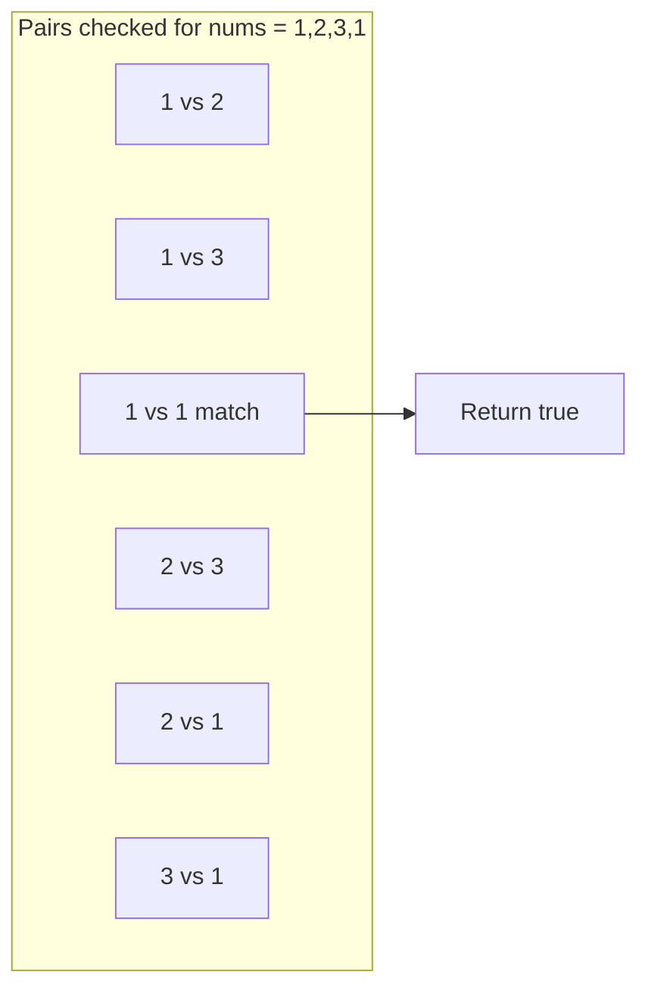
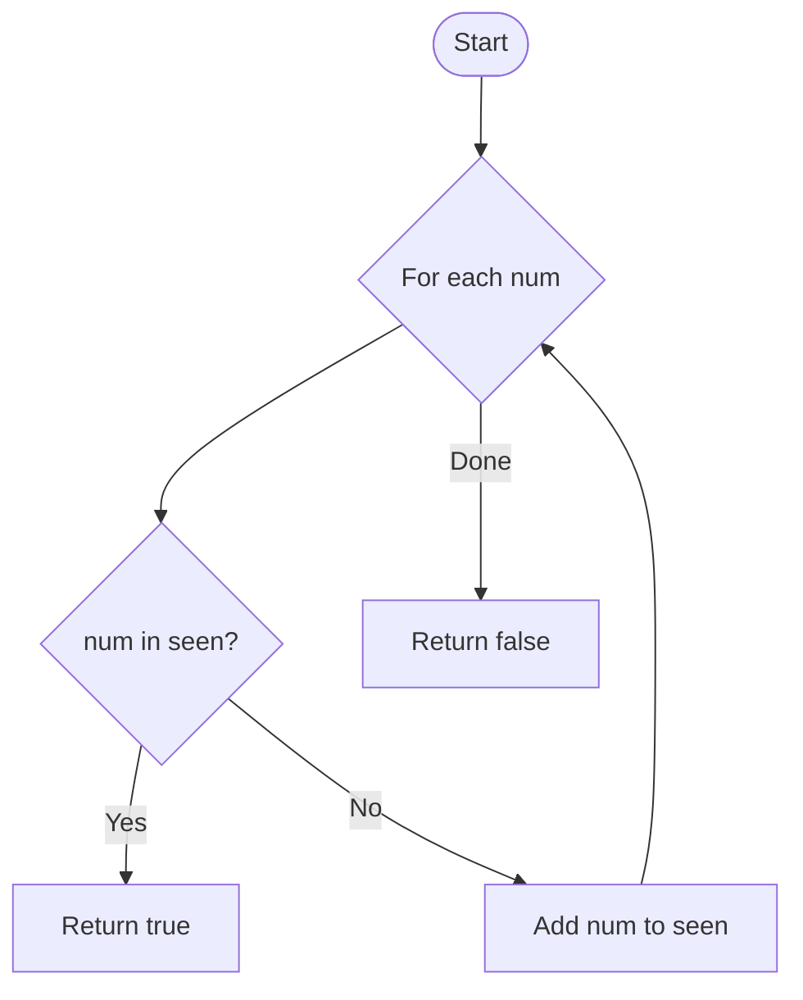
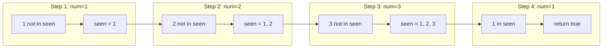
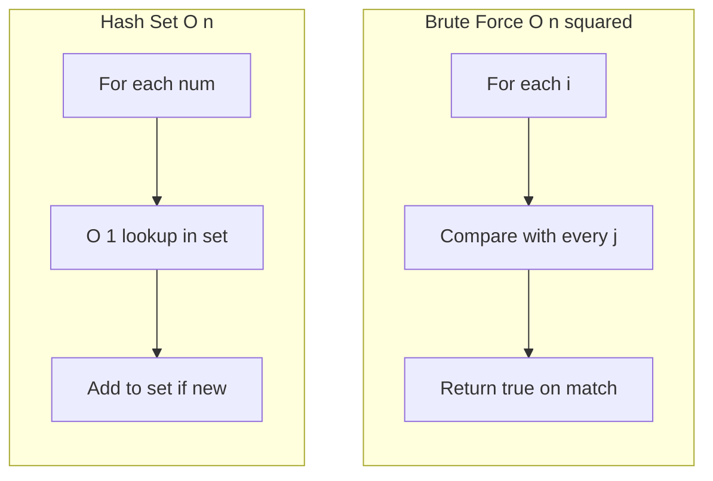

# Contains Duplicate

| | |
|---|---|
| **Difficulty** | Easy |
| **LeetCode** | [#217](https://leetcode.com/problems/contains-duplicate/) |
| **Pattern** | Hash Set |
| **Topics** | Array · Hash Table |

---

## Problem

Given an integer array `nums`, return `true` if any value appears **at least twice**, and `false` if every element is distinct.

**Constraints**

- `1 <= nums.length <= 10^5`
- `-10^9 <= nums[i] <= 10^9`

**Example**

```
nums = [1, 2, 3, 1]

answer = true    →  1 appears at index 0 and 3
```

```
Index:  0   1   2   3
        ┌───┬───┬───┬───┐
nums:   │ 1 │ 2 │ 3 │ 1 │  ← duplicate
        └───┴───┴───┴───┘
         ╲               ╱
          same value: 1
```

---

## Approach 1 — Brute Force

Compare every pair of elements. If any two match, return `true`.



```
nums = [1, 2, 3, 1]

  i=0  →  compare with j=1,2,3  →  match at j=3
```

| | Time | Space |
|---|:---:|:---:|
| Brute force | O(n²) | O(1) |

Works, but re-checks values you have already seen.

---

## The Insight

While scanning `nums`, you do not need to compare the current number with every future number.

Ask one question instead:

> **Have I already seen this value?**

```
nums[3] = 1

seen = {1, 2, 3}

1 already in seen → duplicate found
```

That reframes the problem from *"does any pair match?"* to *"have I seen this before?"*

---

## Approach 2 — Hash Set (One Pass)

Track values you have seen in a set. For each number, check membership in O(1).



**Why a hash set?**

| Operation | Brute force | Hash set |
|---|:---:|:---:|
| "Have I seen this?" | O(n) scan | O(1) lookup |
| Per element | O(n) | O(1) |

A **set** is enough here — you only need presence, not indices or counts (unlike Two Sum).

---

## Dry Run

```
nums = [1, 2, 3, 1]
```



### Step-by-step table

| Step | `num` | In `seen`? | Action | `seen` after |
|:---:|:---:|:---:|---|---|
| 1 | 1 | No | Add `1` | `{1}` |
| 2 | 2 | No | Add `2` | `{1, 2}` |
| 3 | 3 | No | Add `3` | `{1, 2, 3}` |
| 4 | 1 | **Yes** | Return `true` | — |

---

## Brute Force vs Hash Set



| | Brute force | Hash set |
|---|:---:|:---:|
| **Time** | O(n²) | **O(n)** |
| **Space** | O(1) | O(n) |
| **Idea** | Try every pair | Remember what you have seen |

---

## Solution

```python
class Solution:
    def containsDuplicate(self, nums):
        seen = set()

        for num in nums:
            if num in seen:
                return True
            seen.add(num)

        return False
```

| Step | What happens |
|---|---|
| `if num in seen` | O(1) check — duplicate found |
| `seen.add(num)` | Record value for future lookups |
| `return False` | No duplicates after full scan |

---

## Complexity

| Operation | Complexity |
|---|:---:|
| Traverse array | O(n) |
| Set lookup | O(1) avg |
| Set insert | O(1) avg |
| **Total time** | **O(n)** |
| **Space** | **O(n)** |

---

## Key Takeaway

| Instead of asking | Ask |
|---|---|
| *Does any pair match?* | *Have I seen this value before?* |

Same hash-map family as Two Sum — but here a **set** is enough because you only care about existence, not position.

---

## Pattern

**Hash Set** — reach for it when a problem asks:

- Have I seen this value before?
- Are all elements unique?
- Can I replace repeated linear scans with O(1) lookups?

If yes, a set (or dict) is likely the right tool.

---

## Related problems

- [Valid Anagram](https://leetcode.com/problems/valid-anagram/) (#242)
- [Two Sum](https://leetcode.com/problems/two-sum/) (#1)
- [Contains Duplicate II](https://leetcode.com/problems/contains-duplicate-ii/) (#219)
- [Contains Duplicate III](https://leetcode.com/problems/contains-duplicate-iii/) (#220)
