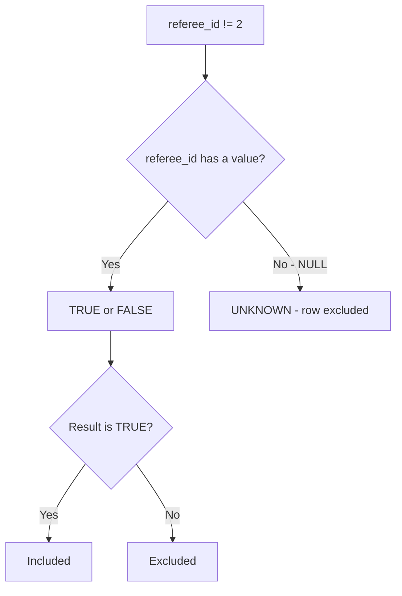
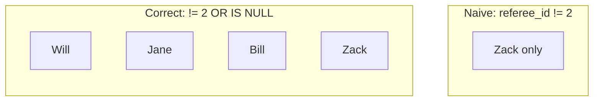
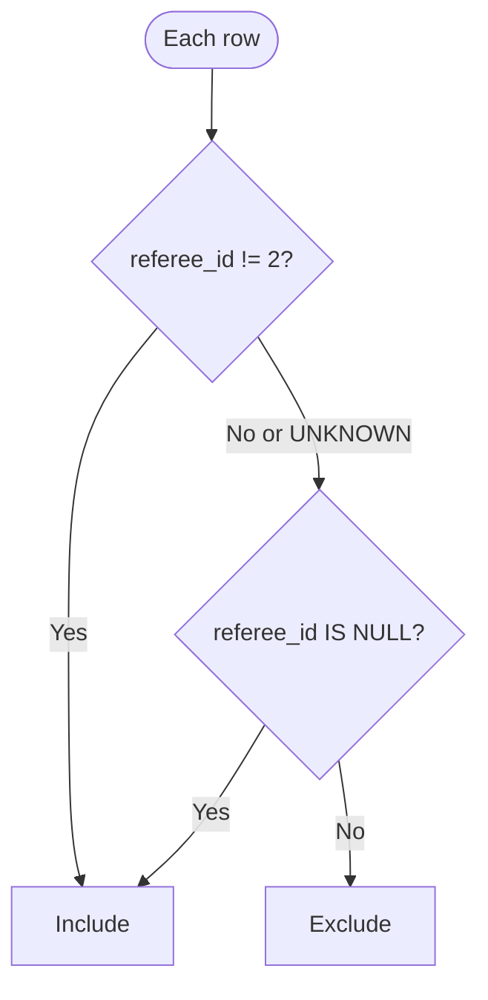
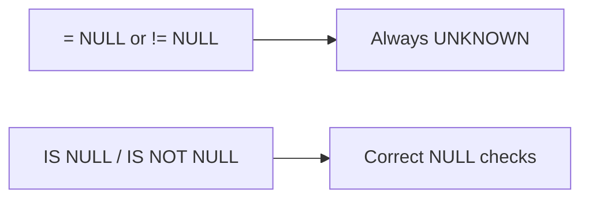

# Find Customer Referee

| | |
|---|---|
| **Difficulty** | Easy |
| **LeetCode** | [#584](https://leetcode.com/problems/find-customer-referee/) |
| **Pattern** | Filtering · NULL Handling |
| **Topics** | SQL · WHERE · NULL |

---

## Problem

Write a query to return the **names** of customers whose referee is **not** customer `id = 2`.

**Constraints**

- Customers with no referee (`NULL`) must be included
- Return the `name` column only

---

## Understanding the table

### Customer

| id | name | referee_id |
|:---:|:---:|:---:|
| 1 | Will | NULL |
| 2 | Jane | NULL |
| 3 | Alex | 2 |
| 4 | Bill | NULL |
| 5 | Zack | 1 |
| 6 | Mark | 2 |

```
Customer          referee_id
────────          ──────────
Will       →      NULL
Jane       →      NULL
Alex       →      2
Bill       →      NULL
Zack       →      1
Mark       →      2
```

**Expected output:** Will, Jane, Bill, Zack

---

## First thought

The natural filter:

```sql
WHERE referee_id != 2
```

Reads as *"referee is not 2"* — but this **drops every row where `referee_id` is NULL**.

---

## The insight — NULL is not a value

`NULL` does not mean *"not equal to 2"*. It means **unknown**.

In SQL, comparisons with `NULL` produce **UNKNOWN**, not `TRUE` or `FALSE`. The `WHERE` clause only keeps rows where the condition is `TRUE`.



| referee_id | `!= 2` | Kept by WHERE? |
|:---:|:---:|:---:|
| 1 | TRUE | Yes |
| 2 | FALSE | No |
| NULL | **UNKNOWN** | **No** |

That is why Will, Jane, and Bill disappear with the naive query — even though the problem wants them.

---

## Naive vs correct



| Customer | referee_id | Naive filter | Correct filter |
|:---:|:---:|:---:|:---:|
| Will | NULL | Excluded | **Included** |
| Jane | NULL | Excluded | **Included** |
| Alex | 2 | Excluded | Excluded |
| Bill | NULL | Excluded | **Included** |
| Zack | 1 | Included | **Included** |
| Mark | 2 | Excluded | Excluded |

---

## Solution

Explicitly include rows where the referee is unknown:

```sql
SELECT name
FROM Customer
WHERE referee_id != 2
   OR referee_id IS NULL;
```



| Clause | Role |
|---|---|
| `referee_id != 2` | Keep customers not referred by id 2 |
| `OR referee_id IS NULL` | Keep customers with no referee |

---

## Dry run

| Customer | referee_id | `!= 2` | `IS NULL` | Included? |
|:---:|:---:|:---:|:---:|:---:|
| Will | NULL | UNKNOWN | Yes | **Yes** |
| Jane | NULL | UNKNOWN | Yes | **Yes** |
| Alex | 2 | No | No | No |
| Bill | NULL | UNKNOWN | Yes | **Yes** |
| Zack | 1 | Yes | No | **Yes** |
| Mark | 2 | No | No | No |

**Final result**

| name |
|:---:|
| Will |
| Jane |
| Bill |
| Zack |

---

## Common mistakes

### Forgetting NULL

```sql
-- Wrong: excludes all NULL rows
WHERE referee_id != 2
```

### Comparing NULL with = or !=

```sql
-- Wrong: always UNKNOWN, never TRUE
WHERE referee_id = NULL
WHERE referee_id != NULL
```

```sql
-- Correct
WHERE referee_id IS NULL
WHERE referee_id IS NOT NULL
```



---

## Complexity

| Metric | Complexity |
|---|:---:|
| Time | O(n) |
| Space | O(1) |

The database scans each row once.

---

## Key takeaway

| Before filtering | Ask |
|---|---|
| Does this column allow NULL? | Should NULL rows be included or excluded? |
| Using != or = ? | Use IS NULL / IS NOT NULL for NULL checks |

Three-valued logic: `TRUE`, `FALSE`, and `UNKNOWN`. Only `TRUE` passes `WHERE`.

---

## Pattern

**NULL handling** — reach for it when a problem mentions:

- Missing or unknown values
- Optional relationships
- Empty references

Always decide explicitly: **include NULL or exclude it?**

---

## Interview questions

**Why doesn't `NULL != 2` return TRUE?**
- `NULL` is unknown — any comparison with it yields UNKNOWN, not TRUE or FALSE

**Why use `IS NULL`?**
- `=` and `!=` cannot test for NULL; SQL provides `IS NULL` and `IS NOT NULL`

**When to add `OR ... IS NULL`?**
- When the requirement says missing values should appear in the result

---

## Related problems

- [Employees Earning More Than Their Managers](https://leetcode.com/problems/employees-earning-more-than-their-managers/) (#181)
- [Customers Who Never Order](https://leetcode.com/problems/customers-who-never-order/) (#183)
- [Employee Bonus](https://leetcode.com/problems/employee-bonus/) (#577)
- [Duplicate Emails](https://leetcode.com/problems/duplicate-emails/) (#182)
