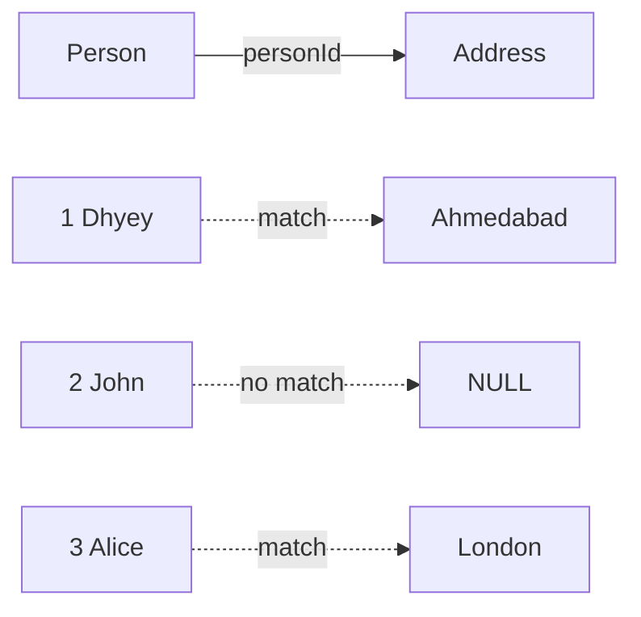
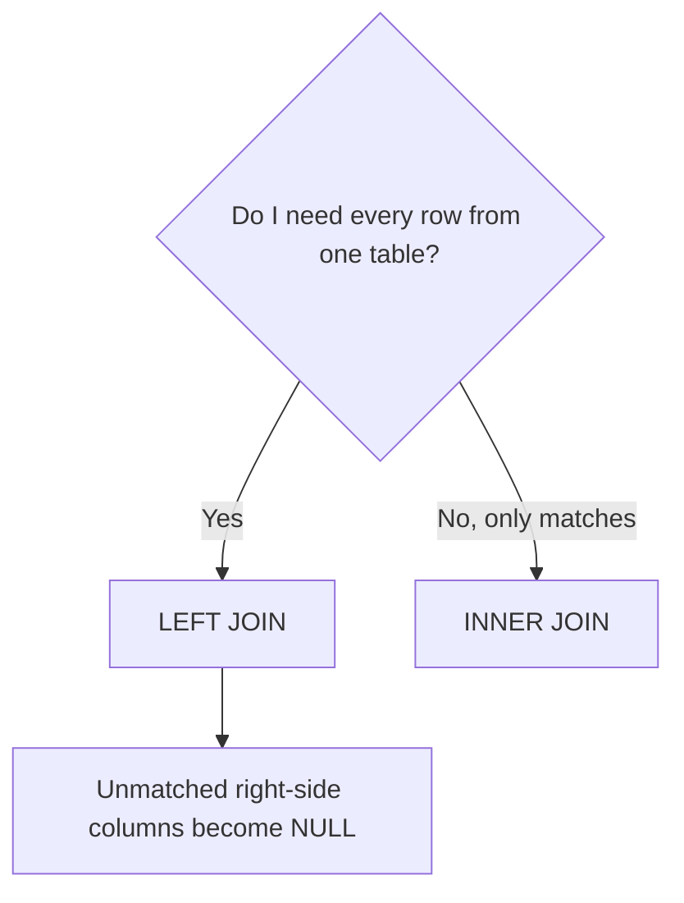
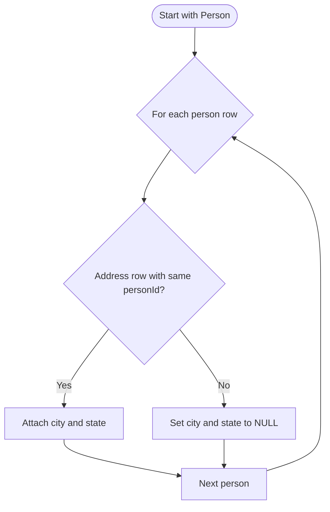
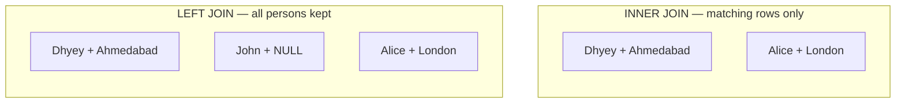
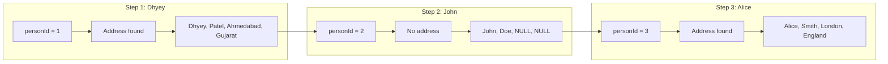
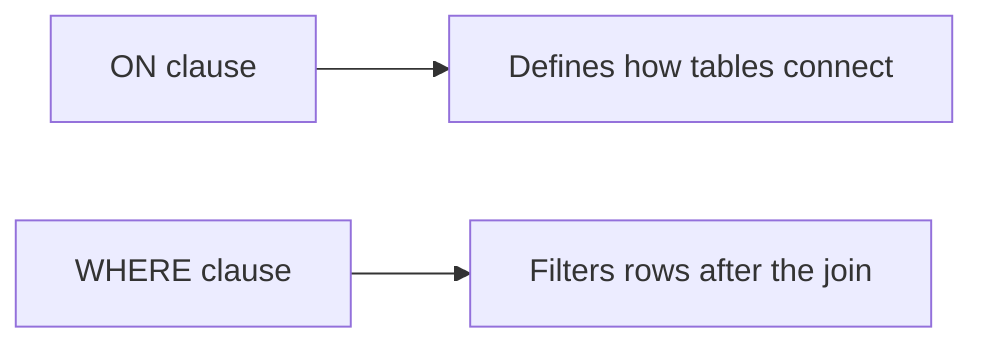

# Combine Two Tables

| | |
|---|---|
| **Difficulty** | Easy |
| **LeetCode** | [#175](https://leetcode.com/problems/combine-two-tables/) |
| **Pattern** | LEFT JOIN |
| **Topics** | SQL · Joins |

---

## Problem

Given two tables, **Person** and **Address**, report each person's first name, last name, city, and state.

**Constraints**

- Every person must appear in the result
- If a person has no address, return `NULL` for `city` and `state`

---

## Understanding the tables

### Person

| personId | firstName | lastName |
|:---:|:---:|:---:|
| 1 | Dhyey | Patel |
| 2 | John | Doe |
| 3 | Alice | Smith |

### Address

| addressId | personId | city | state |
|:---:|:---:|:---:|:---:|
| 1 | 1 | Ahmedabad | Gujarat |
| 2 | 3 | London | England |



**Relationship:** `Person.personId` (PK) ← `Address.personId` (FK)

---

## First thought

The answer spans two tables — names live in **Person**, location in **Address**. They connect on:

```
personId
```

Before writing SQL, ask: **which table drives the result?**

---

## The insight

The problem says *every person* should appear, even without an address.

That means **Person** is the source of truth — not Address.

| Requirement | Implication |
|---|---|
| All persons in output | Person must be the left table |
| Missing address = NULL | Need a join that keeps unmatched rows |
| **Answer** | **LEFT JOIN** |



---

## LEFT JOIN intuition



```
Person (left)              Address (right)
─────────────              ───────────────
1  Dhyey        ────────►  1  Ahmedabad
2  John          (none)         NULL
3  Alice         ────────►  3  London
```

**LEFT JOIN rules**

1. Keep every row from the **left** table
2. If a match exists on the right, attach it
3. If no match, right-side columns are `NULL`

---

## INNER JOIN vs LEFT JOIN

Why not INNER JOIN here? John has no address — INNER JOIN would drop him entirely.



| | INNER JOIN | LEFT JOIN |
|---|:---:|:---:|
| **Keeps unmatched left rows** | No | **Yes** |
| **Result for John** | Excluded | NULL address |
| **Use when** | Only matches matter | Left table is source of truth |

---

## Solution

```sql
SELECT
    p.firstName,
    p.lastName,
    a.city,
    a.state
FROM Person p
LEFT JOIN Address a
    ON p.personId = a.personId;
```

| Clause | Role |
|---|---|
| `FROM Person p` | Left table — every person starts here |
| `LEFT JOIN Address a` | Attach address when it exists |
| `ON p.personId = a.personId` | Match condition between tables |
| `SELECT p.*, a.city, a.state` | Pull columns from both sides |

---

## Dry run



### Step-by-step table

| Step | Person | Match in Address? | city | state |
|:---:|:---:|:---:|---|---|
| 1 | Dhyey (id=1) | Yes | Ahmedabad | Gujarat |
| 2 | John (id=2) | No | NULL | NULL |
| 3 | Alice (id=3) | Yes | London | England |

**Final result**

| firstName | lastName | city | state |
|:---:|:---:|:---:|:---:|
| Dhyey | Patel | Ahmedabad | Gujarat |
| John | Doe | NULL | NULL |
| Alice | Smith | London | England |

---

## Common mistakes

### Using WHERE instead of ON

```sql
-- Wrong: filters out NULL rows, behaves like INNER JOIN
FROM Person
LEFT JOIN Address
WHERE Person.personId = Address.personId
```

```sql
-- Correct: ON defines the join condition
FROM Person p
LEFT JOIN Address a
    ON p.personId = a.personId
```



| Clause | When it runs | Purpose |
|---|---|---|
| `ON` | During the join | Link rows between tables |
| `WHERE` | After the join | Filter the combined result |

Putting the join condition in `WHERE` removes rows where the right side is NULL.

---

## Complexity

| Metric | Complexity |
|---|:---:|
| Time | O(n + m) with hash join on indexed keys |
| Space | Depends on execution plan |

Actual performance depends on indexes on `personId` and the database optimizer.

---

## Key takeaway

| Before writing SQL | Ask |
|---|---|
| Which table is source of truth? | Person — everyone must appear |
| How are tables related? | `personId` |
| All rows or only matches? | All persons → LEFT JOIN |

---

## Pattern

**LEFT JOIN** — use it when a problem says:

- Return all rows from one table
- Related records may not exist
- Missing values should be `NULL`

---

## Interview questions

**LEFT JOIN vs INNER JOIN?**
- INNER JOIN: matching rows only
- LEFT JOIN: every left row kept; unmatched right columns are NULL

**Why ON instead of WHERE?**
- `ON` = how tables connect during the join
- `WHERE` = filter after the join

**What if there is no matching row?**
- Right-table columns become `NULL`

**Table relationship?**
- `Person.personId` → Primary Key
- `Address.personId` → Foreign Key

---

## Related problems

- [Employee Bonus](https://leetcode.com/problems/employee-bonus/) (#577)
- [Find Customer Referee](https://leetcode.com/problems/find-customer-referee/) (#584)
- [Customers Who Never Order](https://leetcode.com/problems/customers-who-never-order/) (#183)
